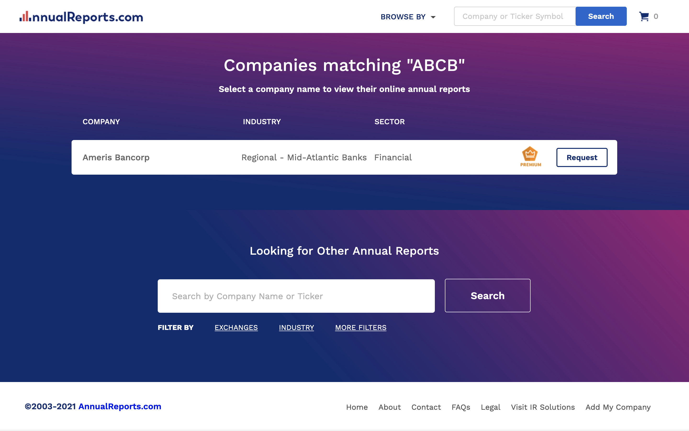
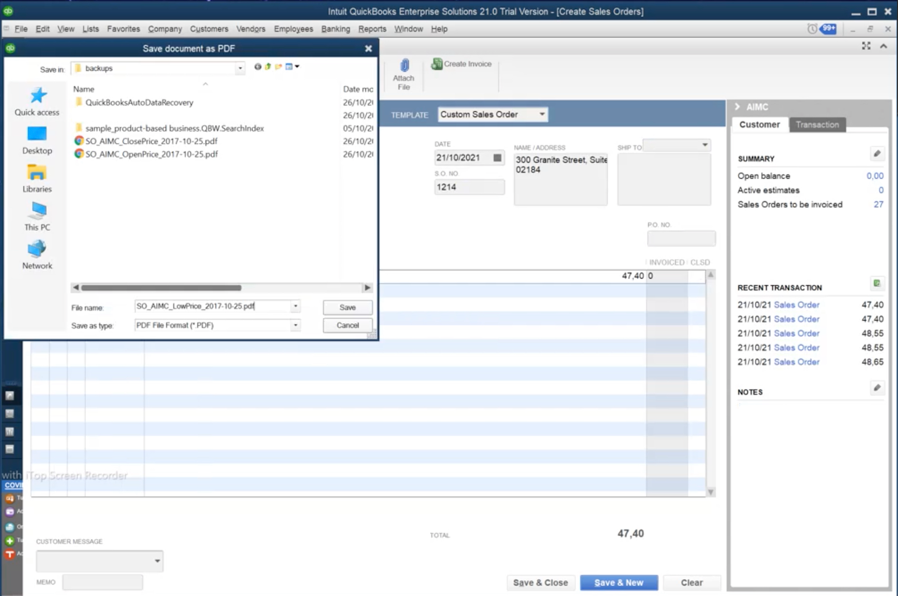

# Work data management and granny's spaghetti

_Teddy & spaghetti photos from Unsplash.com_

> "Her hands are sweaty, morale weak, mouse feels heavy 
> There's tomato sauce on her sweater, granny's spaghetti 
> She's tired, but on her lap, she has her teddy"

Once upon a time, there was an office worker. Her job was great and fulfilling most of the time. Except at the end of each fiscal year. This is her story.

"Don't worry." her boss said.

"It's as easy as catching salmon with your bare hands. Bears do it all the time!"

"But bears have paws..." she started.

"Let me explain the process, so you know how to complete it, ok?" her boss interrupted.

"Each year, we collect some very important data from various systems and then enter it into our company ERP." her boss explained.

"And...?" she asked.

"And that's it. Good luck!" her boss smiled and hurried out of the door.

Luckily, she managed to find someone in the office who explained the process in _a bit_ more detail.

"Ok. First, you navigate to Nasdaq's website and download this Excel spreadsheet." the helpful person explained.

"There, you will find a few company stock tickers."

"A few?" she asked.

"Yes! Five thousand tickers!" the helpful person smiled happily.

After a few moments of contemplating her life choices, she gathered herself and asked:

"And what do I do with that handful of tickers?"

"Glad you asked!" the helpful person exclaimed.

"You navigate to Yahoo Finance's website. For each ticker, you open the page for that ticker and take a screenshot of this market data." she demonstrated.

"For five thousand tickers?" she verified with a hint of fear in her voice.

"For five thousand tickers!" exclaimed the always so cheerful person.

"Now you have half of the required data." the helpful person explained.

"Where's the other half?" she queried worriedly.

"No worries, my friend! The rest of the data can be found on another site: https://www.annualreports.com/."

"Dare I ask in what format that data is on that site?" she asked, fearing the answer.

"You are in luck! The data is beautifully laid out in PDF documents!"

She felt her heart skip a beat. No. Not PDF documents. Anything else but those.

"Inside those documents, you look for this specific heading and then copy and paste the data from that page." the helpful person continued.

"Is the data always on the same page in each of the documents?" she asked, not sure if she was ready to handle the response.

"No, of course not!" the other person laughed.

"Sometimes it's on the first page, sometimes on any other page!"

"Ok. And how many pages are in one document?"

"No more than two hundred."

Cold sweat drenched her back. After picking herself up from the floor, she managed to continue:

"And now that I have the market data screenshots and the company detail PDF documents, then what?"

"Then, you log in to our company ERP application and create a sales order for each company."

"You export each sales order as a PDF file."

"Finally, for each company, you email the market data and the company details and attach the PDF files."

Breathing heavily, she asked:

"And how long does this process usually take...?"

"Oh, it needs to be completed by the end of the year, so if you start in September, you should be fine!"

"September? That's... four months?" she calculated, fighting away the tears of panic.

"Yes, give or take. Good luck!" the helpful person exclaimed happily and disappeared to her cubicle.

> Back at her desk, wiping her sweaty palms, tiredly reaching for her mouse that felt exceptionally heavy that morning, glancing at the delicious spaghetti sauce stain on her sweater, she placed her teddy bear on her lap for mental support and navigated to Nasdaq's website.

## Process summary

Whew! To summarize the process:

Fetch thousands of stock tickers from the Nasdaq website as an Excel spreadsheet. (This can be done using browser automation.)

For each ticker, get a screenshot of the market data from Yahoo Finance's website. (This can be done using browser automation.)

For each ticker, download the company info PDF document from https://www.annualreports.com/. (This can be done using browser automation.)

For each company, find the relevant data from the market data screenshots. (This can be done programmatically using OCR (optical character recognition).)

For each company, find the relevant page and data from the PDF documents. (This can be done by writing some PDF data extraction code in Python.)

Input the required data from the screenshots and the PDF documents to the Windows-based ERP application. (This can be done using Robocorp Workforce Agent and Windows automation.)

Export each entry from the ERP as a PDF document. (This can be done using Windows automation.)

Email the PDF documents to the recipients. (This can be done using email automation.)

That's **a lot of work** for any person to handle! Not even a teddy bear is probably enough.

## How to Robocorp

Maybe we can help the poor office worker in distress? Let's see how the same process could be automated with Robocorp.

We could split the process into three distinct tasks.

The first task fetches the tickers from Nasdaq.

The second task collects all the required data for each ticker.

The third and final task enters the data into the ERP system and sends out the verification emails.

## Multiple execution environments

The first and the second task can be run in a Control Room container. The advantage of that is you do not need to host the run environments yourself. It just works! Let your IT department take the afternoon off and enjoy some carbonara instead.

The third task requires interacting with a Windows-based desktop application. It can be run in a Windows environment using Robocorp Workforce Agent. Robocorp also supports macOS and Linux!

## Enabling high performance and error handling with work items and parallel execution

The second step, collecting all the required data for each ticker, involves taking thousands of screenshots, downloading thousands of humongous PDF documents, and finding and scraping data out of the images and documents.

Even when the robot goes as fast as it can, it is restricted by the speed of the systems where it gathers the data from. Sure, it can work more quickly than a human (or match the speed of a teddy bear - those things are fast!) but is there a way to improve the speed even further?

Luckily, there's a built-in solution in Control Room to address that challenge.

To speed up the task execution, we can configure Control Room to use **parallel processing**. Instead of collecting the company data one ticker at a time, we can simultaneously collect data for many companies. It's like an army of teddy bears!

To enable parallel processing, we should split our work into small chunks, **work items**, so that each of those items can be processed separately. In this case, one ticker becomes one work item.

We can tell our robot to process multiple work items at the same time using the parallel execution support in Control Room. This results in faster process execution. Neat!

In addition to enabling parallel processing, work items have other advantages, too.

We can monitor the status of work flowing through the process in real-time. Piece by piece, work gets completed. Captivating!

If something goes wrong when processing a single work item (for example, when some data is invalid), that item can be marked as failed. The processing can then continue with the rest of the work items - no need to halt the whole caravan due to one camel running out of humps.

The failed work items can be manually handled and re-run later without re-running _everything_. This way, you can avoid processing already successfully processed items again.

So, instead of running all the data gathering for the thousands of tickers again, we can fix the data in the failed work items and re-run only those items.

Pretty sweet!

## More about execution environments

Back to the third task.

This task involves entering the data into the Windows-based ERP system and sending out the verification emails.

Conveniently, as already mentioned, Robocorp supports **multiple execution environments**. In addition to Control Room containers, you can run tasks in other environments, too.

In this case, the robot needs to interact with a desktop application. This scenario is supported by installing the Robocorp Workforce Agent on the Windows machine.

The Robocorp Workforce Agent handles downloading, installing, and running the robot on the Windows machine.

This way, the robot gets access to the ERP application and can start entering the data, exporting and saving the entered data as PDF documents, and sending out the verification emails with the PDF documents attached.

# The advantages of Robocorp, work data management, and work items

To recap, here are some powerful things you can do with Robocorp:

- Interact with multiple systems and data sources - web applications, desktop applications, email, images, PDF documents, and much more.

- Find and read data from images and PDF documents.

- Split processes into separate, clear, human-readable tasks.

- Run in Control Room containers to avoid self-hosted infra pain.

- Take advantage of multiple execution environments by also running on a Windows environment within the same process. Or macOS. Or Linux!

- Use work items to enable parallel execution of work for faster process completion.

- Monitor the status of work flowing through the process.

- View, manually fix and re-run the failed items.

# Learn more

- [Work data management in Control Room](https://robocorp.com/docs/control-room/operating-workforce/work-data-management)
- [Using work items](https://robocorp.com/docs/development-guide/control-room/work-items)
